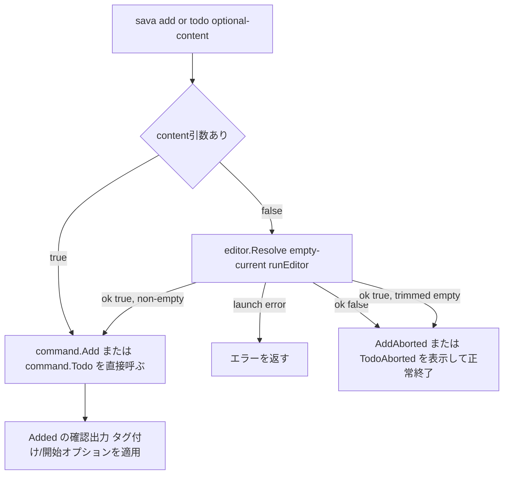

# Technical Design

## Overview
本機能は、`sava add`/`sava todo`でcontent引数を省略したときに、`sava edit`と同じ`internal/editor.Resolve`を再利用してエディタ（`$EDITOR`→`$VISUAL`→`vi`）を起動し、新規メモ・タスクを書けるようにする。

**Purpose**: シェル引数の制約を受けずに、複数行の内容やその場で考えながら書く内容を、既存の`sava edit`と同じ操作感で新規作成できるようにする。
**Users**: `sava add`/`sava todo`を使う全ユーザー。
**Impact**: `add`/`todo`のCLI層に分岐ロジックを追加する。`internal/log`/`internal/model`/`internal/logfile`、および直接指定モードの既存動作（`add <content>`/`todo <content>`）は変更しない。

### Goals
- `add`/`todo`でcontent引数を省略したとき、`internal/editor.Resolve`を再利用してエディタを起動できるようにする
- エディタでの保存内容が空文字列、または空白文字のみの場合は中断とし、メモ・タスクを作成しない（エラーにはしない）
- エディタ経由で作成したメモ・タスクにも、直接指定モードと同様に`--tag`/`--start`が効くようにする
- 直接指定モード（content引数あり）の既存動作は一切変更しない

### Non-Goals
- `sava edit`のエディタ挙動自体の変更（既存仕様のまま）
- `add`/`todo`の直接指定モードにおける空文字列検証ロジック（`internal/log.Add`の`ErrEmptyContent`）の変更
- `add`/`todo`/`edit`をまたぐ共通のエディタ起動抽象への一般化（現時点の要件はCLI層の分岐追加のみで満たせるため）

## Boundary Commitments

### This Spec Owns
- `cmd/sava`の`newAddCommand`/`newTodoCommand`における、content省略時のエディタ起動・中断判定分岐ロジック
- `internal/view.AddAborted`/`internal/view.TodoAborted`（中断メッセージ）
- `internal/command.AddAborted`/`internal/command.TodoAborted`（view層への薄い委譲）

### Out of Boundary
- `internal/editor.Resolve`/`internal/editor.Name`自体のロジック（`sava edit`と共有しており、本スペックでは変更しない）
- `internal/log.Add`、および`command.Add`/`command.Todo`の直接指定モードにおけるcontent検証ロジック（`empty-content-validation`スペックの範囲のまま）
- `sava edit`コマンド自体の挙動（`edit-command`スペックの範囲のまま）

### Allowed Dependencies
- `internal/editor.Resolve`/`internal/editor.Name`（既存、そのまま呼び出す）
- `internal/command.Add`/`internal/command.Todo`（既存シグネチャのまま、解決済みのcontentを渡すだけ）
- `internal/view`の既存パターン（`EditAborted`と同型の固定メッセージ関数）

### Revalidation Triggers
- `internal/editor.Resolve`のok判定基準（保存内容が`current`と同一、または空文字列なら中断）が変わった場合
- `internal/log.Add`の空文字列検証基準（トリム後空文字列を拒否）が変わった場合、本スペックのwhitespace-only中断判定との整合を再確認する必要がある
- 将来、`add`/`todo`以外のコマンドにも同種のエディタ起動フローを追加する場合（CLI層の分岐ロジックを共通ヘルパーへ切り出す契機）

## Architecture

### Existing Architecture Analysis
- `sava edit`（`edit-command`スペック）が、CLI層（`cmd/sava`）でcontent引数の有無に応じて直接指定モード/エディタモードを分岐するパターンを既に確立している：`internal/editor.Resolve(current, runEditor)`を呼び、`ok`に応じて中断メッセージ表示 or 実際の書き換え処理へ進む。
- `internal/log.Add`は`empty-content-validation`スペックにより、トリム後空文字列のcontentを`ErrEmptyContent`で拒否する検証を既に持つ。直接指定モードの`add`/`todo`はこの検証をそのまま利用する。
- `runEditor`（本番用の`launch`関数、`exec.Command`をstdin/stdout/stderr接続で実行）は`cmd/sava/commands.go`に既に定義されており、`newEditCommand`が利用している。

### Architecture Integration
- **Selected pattern**: `newEditCommand`で確立済みのCLI層分岐パターン（`editor.Resolve`呼び出し→`ok`で分岐）を`add`/`todo`にも適用する。新規パッケージ・新規レイヤーは追加しない。
- **Domain/feature boundaries**: 「contentの取得元解決（直接指定 or エディタ）と、空/空白のみによる中断判定」はCLI層（`cmd/sava`）の責務。「アイテムの作成・タグ付け・タスク開始・永続化」は既存の`internal/command.Add`/`command.Todo`の責務のまま変更しない。両者は`command.Add`/`command.Todo`が受け取る最終的な`content string`を境界として分離される。
- **Existing patterns preserved**: `newEditCommand`の`editor.Resolve`呼び出し・`ok`分岐パターン。`EditAborted`と同型の`command`/`view`中断通知関数パターン。
- **New components rationale**: 新規に追加するのは中断通知関数（`view`/`command`各2つ）のみ。`internal/editor`・`internal/log`・`internal/model`への変更は無い。
- **Steering compliance**: 依存方向`cmd → command → log/logfile/index/view`を維持する。`cmd/sava`は本スペックでも`internal/log`への依存を追加しない（空白のみ判定は`strings.TrimSpace`のみで完結させ、`log.ErrEmptyContent`は参照しない）。

### Add/Todo Content Resolution Flow



**Key Decisions**:
- `command.Add`/`command.Todo`自体は、contentがどこから来たか（直接指定かエディタか）を一切知らない。どちらの経路でも最終的に同じ`command.Add(w, dir, content, opts)`/`command.Todo(w, dir, content, opts)`という呼び出しに収束する（`sava edit`が`command.Edit`に収束するのと同じ設計）。
- 「エディタの保存内容が空白文字のみ」というケースは、`editor.Resolve`自身の`ok`判定（`candidate == current || candidate == ""`)では捕捉されない（`current`は常に`""`なので、空白1文字でも`candidate != ""`となり`ok=true`になる）。これを`command.Add`/`command.Todo`（＝`log.Add`のトリム検証）に委ねると、直接指定モード用の`ErrEmptyContent`がそのままエラーとして表面化し、要件2.4（中断・エラーにしない）に反する。そのためCLI層で`ok=true`後に`strings.TrimSpace(content) == ""`を追加でチェックし、該当すれば`ok=false`と同じ中断経路に合流させる。

## Technology Stack

| Layer | Choice / Version | Role in Feature | Notes |
|-------|------------------|------------------|-------|
| CLI | Go 1.26 / spf13/cobra（既存） | `add`/`todo`のcontent引数を任意にし、省略時にエディタ分岐を行う | 新規依存なし |

新規の外部ライブラリ・インフラ変更は無い。`internal/editor`（エディタ起動・一時ファイル管理）は`edit-command`スペックの成果をそのまま再利用する。

## File Structure Plan

### Modified Files
- `cmd/sava/commands.go` — `newAddCommand`/`newTodoCommand`の`Args`を`cobra.MaximumArgs(1)`に変更する。content省略時の共通ロジックとして`resolveNewContent(args []string) (content string, ok bool, err error)`を追加し、両コマンドから利用する：`len(args) == 1`ならそのまま`(args[0], true, nil)`を返し、`0`なら`editor.Resolve("", runEditor)`を呼び、`err != nil`ならそのまま返し、`!ok`または`strings.TrimSpace(content) == ""`なら`("", false, nil)`を返す。`newAddCommand`/`newTodoCommand`の`RunE`は、`ok`が`false`のとき`command.AddAborted(w)`/`command.TodoAborted(w)`を呼んで`nil`を返し、`true`のとき従来通り`command.Add`/`command.Todo`を呼ぶ。
- `internal/command/command.go` — `AddAborted(w io.Writer)`/`TodoAborted(w io.Writer)`を追加する（`EditAborted`と同型、`view`層への薄い委譲）。
- `internal/command/command_test.go` — `AddAborted`/`TodoAborted`が期待通り`view`の対応関数へ委譲することを検証するテストを追加する。
- `internal/view/view.go` — `AddAborted(w io.Writer)`/`TodoAborted(w io.Writer)`を追加する（`EditAborted`と同型の固定メッセージ出力）。
- `internal/view/view_test.go` — 上記2関数の出力を検証するテストを追加する。
- `cmd/sava/root_test.go` — content省略時のエンドツーエンドテスト（エディタ経由での作成、空/空白のみによる中断、エディタ異常終了、`--tag`/`--start`との統合、中断時にオプション処理が走らないこと、直接指定モードが従来通りであること）を追加する。

新規ファイル・新規パッケージは無い。`internal/editor`, `internal/log`, `internal/model`, `internal/logfile`, `internal/index`は変更しない。

## Requirements Traceability

| Requirement | Summary | Components | Interfaces | Flows |
|-------------|---------|------------|------------|-------|
| 1.1, 1.2 | content省略時にエディタで編集可能なファイルを用意する | `cmd.resolveNewContent`, `cmd.newAddCommand`, `cmd.newTodoCommand` | `resolveNewContent(args) (content, ok, err)` | Content Resolution Flow（HasContent=false） |
| 1.3, 1.4, 1.5 | `$EDITOR`→`$VISUAL`→`vi`の優先順位 | `internal/editor.Name`（既存、再利用） | `Name() string` | 同上 |
| 2.1, 2.2 | 保存内容が非空・非空白なら作成 | `cmd.resolveNewContent`, `command.Add`, `command.Todo` | 同上 | Content Resolution Flow（ok=true分岐） |
| 2.3 | 空文字列保存は中断 | `cmd.resolveNewContent`（`editor.Resolve`のok=false）, `command.AddAborted`/`TodoAborted` | 同上 | 同上（ok=false分岐） |
| 2.4 | 空白文字のみの保存も中断 | `cmd.resolveNewContent`（追加のTrimSpaceチェック）, `command.AddAborted`/`TodoAborted` | 同上 | 同上 |
| 2.5 | エディタ異常終了はエラー | `internal/editor.Resolve`（既存、再利用） | 同上 | Content Resolution Flow（launch error分岐） |
| 3.1, 3.2 | エディタ経由でも`--tag`が効く | `command.Add`, `command.Todo`（既存、変更なし） | — | Content Resolution Flow（CallCreate以降） |
| 3.3 | エディタ経由でも`--start`が効く | `command.Todo`（既存、変更なし） | — | 同上 |
| 3.4 | 中断・エラー時はオプション処理をしない | `cmd.newAddCommand`, `cmd.newTodoCommand`（`command.Add`/`Todo`を呼ばずに早期return） | — | 同上（AbortMsg/PropagateErr分岐） |
| 4.1 | content引数指定時は従来通り即時処理 | `cmd.resolveNewContent`（`len(args)==1`分岐） | 同上 | Content Resolution Flow（HasContent=true） |
| 4.2 | 直接指定モードの空文字列検証は不変 | `internal/log.Add`（既存、変更なし） | — | Content Resolution Flow（CallCreate、HasContent=true経由） |

## Components and Interfaces

| Component | Domain/Layer | Intent | Req Coverage | Key Dependencies (P0/P1) | Contracts |
|-----------|---------------|--------|---------------|---------------------------|-----------|
| `cmd.resolveNewContent` | CLI (`cmd/sava`) | content引数の有無に応じてcontentを解決し、中断すべきかを判定する | 1.1-1.5, 2.1-2.5, 4.1 | `internal/editor.Resolve`（P0） | Service |
| `cmd.newAddCommand` | CLI (`cmd/sava`) | `resolveNewContent`の結果に応じて`command.Add`または`command.AddAborted`を呼ぶ | 1.1, 2.1, 3.1, 3.4, 4.1 | `resolveNewContent`（P0）, `command.Add`（P0）, `command.AddAborted`（P0） | Service |
| `cmd.newTodoCommand` | CLI (`cmd/sava`) | `resolveNewContent`の結果に応じて`command.Todo`または`command.TodoAborted`を呼ぶ | 1.2, 2.2, 3.2, 3.3, 3.4, 4.1 | `resolveNewContent`（P0）, `command.Todo`（P0）, `command.TodoAborted`（P0） | Service |
| `command.AddAborted` / `command.TodoAborted` | ユースケース (`internal/command`) | 中断を通知する（`view`層への委譲） | 2.3, 2.4 | `view.AddAborted`/`view.TodoAborted`（P0） | Service |

### CLI層 (`cmd/sava`)

#### resolveNewContent / newAddCommand / newTodoCommand

| Field | Detail |
|-------|--------|
| Intent | content引数の有無で直接指定/エディタモードを分岐し、中断すべきかを判定する（`resolveNewContent`）。その結果に応じて`command.Add`/`command.Todo`または対応する`Aborted`関数を呼ぶ（`newAddCommand`/`newTodoCommand`） |
| Requirements | 1.1-1.5, 2.1-2.5, 3.1-3.4, 4.1 |

**Responsibilities & Constraints**
- `resolveNewContent`は`len(args) == 1`のとき、検証なしにそのまま`(args[0], true, nil)`を返す（4.1: 直接指定モードは従来通り即時処理）。
- `len(args) == 0`のとき`editor.Resolve("", runEditor)`を呼ぶ。`err != nil`ならそのまま`("", false, err)`を返す（2.5）。
- `err == nil`かつ`!ok`（`editor.Resolve`自身が空文字列/無変更と判定）なら`("", false, nil)`を返す（2.3）。
- `err == nil`かつ`ok`だが`strings.TrimSpace(content) == ""`（空白文字のみ）なら、同じく`("", false, nil)`を返す（2.4）。`editor.Resolve`自体のok判定基準は変更しない。
- 上記いずれにも該当しない場合のみ`(content, true, nil)`を返す（2.1, 2.2）。
- `newAddCommand`/`newTodoCommand`の`RunE`は、`err != nil`ならそのまま返し、`!ok`なら対応する`Aborted`関数を呼んで`nil`を返し（`command.Add`/`command.Todo`を呼ばないため3.4を自動的に満たす）、`ok`なら従来通り`command.Add`/`command.Todo`を呼ぶ。

**Dependencies**
- Inbound: なし（ルートコマンドから登録）
- Outbound: `internal/editor.Resolve`（P0）, `command.Add`/`command.Todo`/`command.AddAborted`/`command.TodoAborted`（P0）

**Contracts**: Service [x] / API [ ] / Event [ ] / Batch [ ] / State [ ]

##### Service Interface
```go
// resolveNewContent returns the content to create an item with. When
// args already supplies it directly, ok is always true. When args is
// empty, it launches the editor via editor.Resolve with an empty
// initial content; ok is false when the editor left it unchanged
// (still empty) or the saved content is empty or whitespace-only --
// editor.Resolve's own emptiness check only catches an exact "",
// so whitespace-only input is caught here to stay consistent with
// log.Add's trim-based validation without surfacing it as an error.
func resolveNewContent(args []string) (content string, ok bool, err error)
```
- Preconditions: `len(args)`は0または1（cobraの`MaximumArgs(1)`が保証）
- Postconditions: `err != nil`のとき`ok`は無意味（常にfalse）。`err == nil`のとき、`ok`が項目作成の可否を表す。
- Invariants: `ok == true`を返すときの`content`は、トリム後空文字列にならない。

**Implementation Notes**
- Integration: `runEditor`（既存、`newEditCommand`と共有）を`launch`として注入する。
- Validation: 空白のみ判定は`strings.TrimSpace`のみで行い、`internal/log`への依存は追加しない。
- Risks: なし。

### ユースケース層 (`internal/command`)

#### AddAborted / TodoAborted

| Field | Detail |
|-------|--------|
| Intent | 中断（何も作成しなかったこと）を通知する |
| Requirements | 2.3, 2.4 |

**Responsibilities & Constraints**
- いずれも`EditAborted`と同型の薄い委譲のみ：`AddAborted`は`view.AddAborted(w)`を、`TodoAborted`は`view.TodoAborted(w)`を呼ぶ。`cmd/sava`が`internal/view`を直接importせずに済むようにする、既存の層構造を保つため。

**Dependencies**
- Inbound: `cmd/sava.newAddCommand`（`AddAborted`）, `cmd/sava.newTodoCommand`（`TodoAborted`）
- Outbound: `view.AddAborted`/`view.TodoAborted`（P0）

**Contracts**: Service [x] / API [ ] / Event [ ] / Batch [ ] / State [ ]

##### Service Interface
```go
func AddAborted(w io.Writer)
func TodoAborted(w io.Writer)
```

**Implementation Notes**
- Integration: `view.go`に`EditAborted`と並べて追加する固定メッセージ関数（例: `"Add aborted: nothing to save."` / `"Todo aborted: nothing to save."`）にそのまま委譲する。
- Validation: なし。
- Risks: なし。

## Error Handling

### Error Strategy
既存の`newEditCommand`と同じ方針: `editor.Resolve`が返すエラー（エディタの異常終了）はラップせずそのまま`RunE`から返し、cobraの既存のトップレベルエラーハンドリングに委ねる。新しいエラー分類・リトライ・ログ機構は導入しない。

### Error Categories and Responses
- **エディタの異常終了**: `editor.Resolve`が`err`を返す → コマンドはエラー終了（2.5）
- **無変更・空文字列（エディタモード）**: `editor.Resolve`が`ok=false, err=nil`を返す → コマンドは正常終了だが中断メッセージを表示（2.3）
- **空白文字のみ（エディタモード）**: `resolveNewContent`が追加の`TrimSpace`チェックで`ok=false`とする → 上記と同じ中断経路（2.4）
- **直接指定モードでの空文字列**: 本スペックでは変更しない。従来通り`log.Add`の`ErrEmptyContent`がそのままエラーとして返る（4.2）

## Testing Strategy

### Unit Tests（`internal/view/view_test.go`）
- `TestAddAborted_PrintsMessage`（2.3, 2.4関連の出力検証）
- `TestTodoAborted_PrintsMessage`（同上）

### Integration Tests（`internal/command/command_test.go`）
- `TestAddAborted_DelegatesToView` / `TestTodoAborted_DelegatesToView`

### CLI Tests（`cmd/sava/root_test.go`、`$EDITOR`に一時シェルスクリプトを設定して検証）
- `TestAddEditorMode_CreatesMemo`: エディタで内容を書いて保存し、その内容でメモが追加されることを検証（1.1, 1.3, 2.1）
- `TestTodoEditorMode_CreatesTask`: 同上のTodo版（1.2, 2.2）
- `TestAddEditorMode_AbortsWhenEmpty`: エディタが何も書かずに保存した場合、`AddAborted`のメッセージが出て何も追加されないことを検証（2.3）
- `TestAddEditorMode_AbortsWhenWhitespaceOnly`: エディタが空白文字のみ書き込んで保存した場合も中断されることを検証（2.4）
- `TestAddEditorMode_PropagatesEditorError`: エディタスクリプトが非ゼロ終了する場合、エラーになりメモが追加されないことを検証（2.5）
- `TestTodoEditorMode_AbortsWhenEmpty`: Todo版の中断確認（2.3）
- `TestAddEditorMode_WithTagOption`: `--tag`付きでエディタ経由作成した場合、タグが付与されることを検証（3.1）
- `TestTodoEditorMode_WithStartOption`: `--start`付きでエディタ経由作成した場合、タスクが着手状態になることを検証（3.3）
- `TestTodoEditorMode_AbortedSkipsTagAndStart`: 中断時に`--tag`/`--start`の副作用が発生しないことを検証（3.4）
- `TestAddDirectMode_UnaffectedByEditorChange` / `TestTodoDirectMode_UnaffectedByEditorChange`: content引数を指定した場合の既存動作が変わらないことの回帰確認（4.1）

4.2（直接指定モードの空文字列拒否）は`empty-content-validation`スペックの既存テストでカバー済みのため、新規テストは追加しない。
