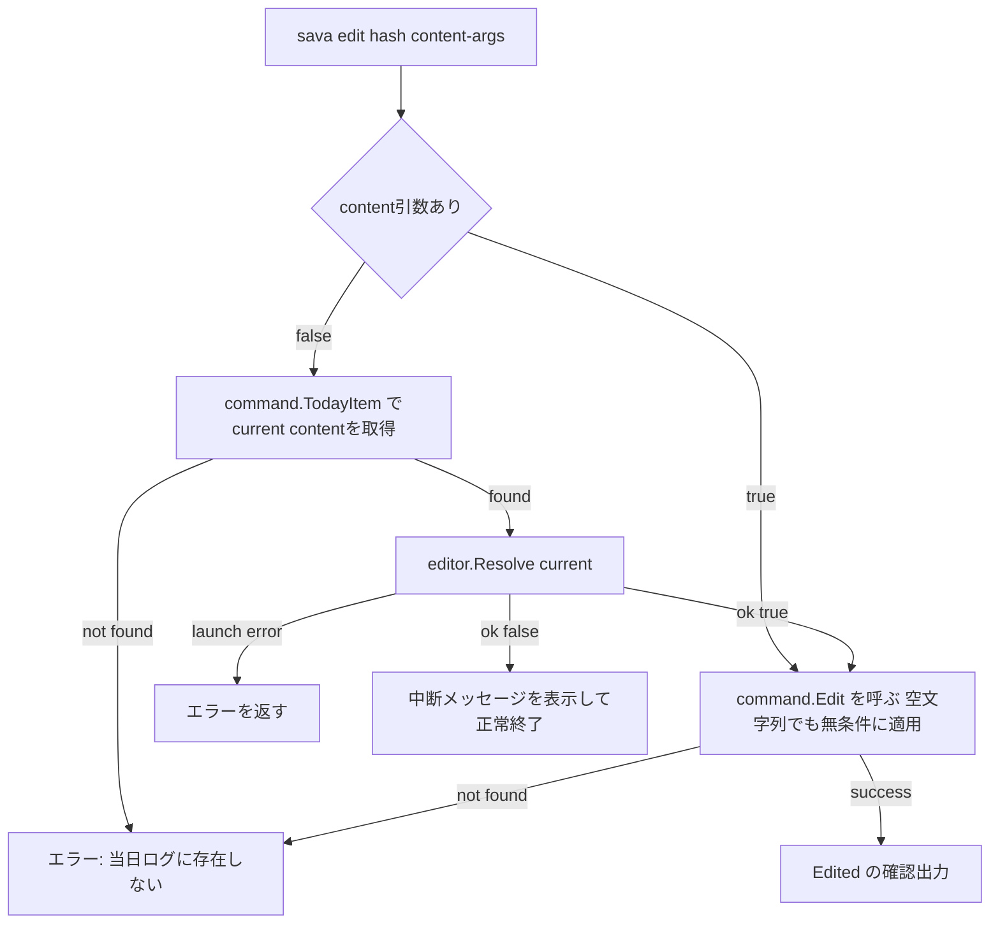

# Technical Design

## Overview
本機能は、当日ログのメモ・タスクのcontentを書き換える `sava edit` コマンドを追加する。

**Purpose**: 誤字や言い回しの修正のために、hashや状態（完了・着手中等）を保ったままcontentだけを書き換えられるようにする。
**Users**: `sava` を日報補助・作業メモとして使う全ユーザー。
**Impact**: 新規コマンドの追加。既存コマンド（`add`/`todo`/`start`/`end`/`tag`等）の挙動は変更しない。

### Goals
- `sava edit <hash> <new content>` で、contentを直接指定して書き換えられるようにする
- `sava edit <hash>`（content省略）で、`$EDITOR`→`$VISUAL`→`vi`の優先順位でエディタを起動し、現在のcontentを編集できるようにする
- エディタでの保存内容が無変更または空文字列のときは、エラーにせず中断する
- hash・CreatedAt・Closed・StartedAtは変更せず、UpdatedAtのみ更新する
- 当日ログのみを対象とし、過去ログ・存在しないhashはエラーにする

### Non-Goals
- 過去ログ（frozen）のcontent編集
- タグ編集（既存`tag`コマンドの役割）、状態変更（既存`start`/`end`コマンドの役割）
- 編集履行・元contentの保持
- `$EDITOR`に指定されたコマンド文字列の完全なシェル互換パース（クオート等）。空白区切りの簡易分割のみサポートする

## Boundary Commitments

### This Spec Owns
- `sava edit` コマンド一式（CLI登録・当日ログの編集・確認出力）
- 新規パッケージ `internal/editor`（エディタ起動・一時ファイル管理・中断判定）
- `internal/log.Edit`/`internal/log.Find`、`internal/command.Edit`/`internal/command.TodayItem`

### Out of Boundary
- `internal/log.Start`/`AddTags`/`RemoveTags` など既存の当日限定コマンドのロジック（変更しない）
- `internal/view.Timeline` 等、表示系の既存ロジック（変更しない）
- 過去ログのfreeze機構そのもの（既存のまま、変更しない）

### Allowed Dependencies
- `internal/command.ensureToday`（既存、書き込み系コマンドの当日ログ取得に使う）
- `internal/logfile.Stat`（既存、読み取り専用の当日ログ取得に使う）
- `internal/model.Item`（`Content`, `UpdatedAt`フィールド）
- `internal/view`の既存`confirmItem`パターン（確認出力の形式をそのまま踏襲）

### Revalidation Triggers
- `model.Item`の`Content`の型・意味が変わった場合
- `ensureToday`/`logfile.Stat`の挙動（特にキャリーフォワードの発生条件）が変わった場合
- 将来、別のコマンドも`$EDITOR`起動を必要とする場合（`internal/editor`の再利用 or 一般化を検討する契機）

## Architecture

### Existing Architecture Analysis
- 既存の当日限定コマンド（`Start`/`Tag`/`AddTags`）は、いずれも`ensureToday`で当日ログを取得し、`internal/log`の関数でhashを検索・ミューテートし、`logfile.Update`で永続化し、`internal/view`で確認出力する、という一直線のパターンに従う。
- `cmd/sava`は現在`internal/command`と`internal/logfile`（ディレクトリ解決のみ）にしか依存しておらず、薄いCLIグルーという性質を保っている。
- 読み取り専用の`list`は`logfile.Stat`を使い、`ensureToday`のキャリーフォワード副作用を起こさない、という区別が既に存在する（`research.md`参照）。

### Architecture Integration
- **Selected pattern**: 既存のレイヤードCLI構成（`cmd` → `command` → `log`/`view`/`logfile`）を維持し、これに加えて`internal/editor`という依存方向上リーフの新規パッケージ（`log`/`model`/`command`に依存しない）を追加する。
- **Domain/feature boundaries**: 「contentの取得元（直接指定 or エディタ）の解決」はCLI層（`cmd/sava`）と`internal/editor`の責務。「当日ログへの反映」は`internal/command.Edit`/`internal/log.Edit`の責務。両者は`command.Edit`が受け取る最終的な`newContent string`を境界として分離される（discoveryでの合意通り）。
- **Existing patterns preserved**: `ensureToday`→`log.X`→`logfile.Update`→`view.X`という既存の当日限定コマンドのパターン。テストしづらい外部要素を関数注入で切り離すパターン（`log.uniqueID`の`next`引数と同種）。
- **New components rationale**: `internal/editor`のみが新規パッケージ。`internal/log`/`internal/command`/`internal/view`への追加は、いずれも既存の型・関数と同じ粒度・形の拡張であり、新しい抽象層は増やさない。
- **Steering compliance**: `structure.md`の依存方向（cmd → command → log/logfile/view/model）を維持。`internal/editor`は`log`/`model`/`command`のいずれにも依存しない、最も下流のリーフパッケージとして追加する。

### Edit Mode Decision Flow



**Key Decisions**:
- `command.Edit`自体は、contentがどこから来たか（直接指定かエディタか）を一切知らない。どちらの経路でも最終的に`command.Edit(w, dir, hash, newContent)`という同じ呼び出しに収束する。
- `command.TodayItem`（エディタ起動前のcurrent content取得）は`logfile.Stat`を使い、キャリーフォワードのような書き込み副作用を起こさない。実際の反映（`command.Edit`）は既存通り`ensureToday`を使う。

## Technology Stack

| Layer | Choice / Version | Role in Feature | Notes |
|-------|------------------|------------------|-------|
| CLI | Go 1.26 / spf13/cobra v1.10.2（既存） | `edit`サブコマンド、content引数を任意にする | 新規依存なし |
| エディタ起動 | Go標準ライブラリ `os/exec`, `os` | `$EDITOR`起動・一時ファイル管理 | 新規外部依存なし。シェルクオート解析等の専用ライブラリは導入しない（空白区切りの簡易分割のみ） |

新規の外部ライブラリ・インフラ変更は無い。

## File Structure Plan

### New Directory Structure
```
internal/
├── editor/                 # New: content resolution via $EDITOR/$VISUAL/vi
│   ├── editor.go           # Resolve, EditorName
│   └── editor_test.go      # Fake launch func; no real process spawned
```

### Modified Files
- `internal/log/log.go` — `Find(l *model.Log, hash string) (model.Item, error)`（読み取り専用ルックアップ、既存の「not found」エラー文言パターンを踏襲）と `Edit(l *model.Log, hash, newContent string) (model.Item, error)`（`Start`と同型のインデックス付きループでcontentを書き換え、`UpdatedAt`を更新。状態による分岐は無く、`newContent`の妥当性検証も行わない。`add`/`todo`が現在validationを行っていないことと一貫させる）を追加。
- `internal/log/log_test.go` — `Find`/`Edit`のユニットテストを追加（見つかる/見つからない、未着手/着手中/完了/メモいずれでも編集可能、`UpdatedAt`のみ更新されhash/CreatedAt/Closed/StartedAtは不変であることを検証）。
- `internal/command/command.go` — `TodayItem(dir, hash string) (model.Item, error)`（`logfile.Stat`＋`log.Find`、読み取り専用）と `Edit(w io.Writer, dir, hash, newContent string) error`（`ensureToday`→`log.Edit`→`logfile.Update`→`view.Edited`）、`EditAborted(w io.Writer)`（`view.EditAborted`への薄い委譲）を追加。
- `internal/command/command_test.go` — `TodayItem`/`Edit`/`EditAborted`の統合テストを追加。
- `internal/view/view.go` — `Edited(w io.Writer, item model.Item)`（既存の`confirmItem(w, "Edited!!", item)`パターンを再利用）と `EditAborted(w io.Writer)`（中断メッセージ出力）を追加。
- `internal/view/view_test.go` — 上記2関数のテストを追加。
- `cmd/sava/commands.go` — `newEditCommand()` を追加（`Args: cobra.RangeArgs(1, 2)`でcontent引数を任意にし、省略時は`command.TodayItem`→`editor.Resolve`→分岐、指定時は`command.Edit`を直接呼ぶ）。本番用のエディタ起動関数 `runEditor(name, path string) error`（`exec.Command`をラップ、stdin/stdout/stderrを実ターミナルに接続）もここに置く。
- `cmd/sava/root_test.go` — 直接指定モードのエンドツーエンドテストと、一時的なシェルスクリプトを`$EDITOR`に設定してエディタモードを検証するテストを追加。

新規ファイルは `internal/editor/editor.go` と `internal/editor/editor_test.go` のみ。`internal/model/`, `internal/logfile/`, `internal/index/` は変更しない。

## Requirements Traceability

| Requirement | Summary | Components | Interfaces | Flows |
|-------------|---------|------------|------------|-------|
| 1.1, 1.2, 1.4 | 直接指定モードでの書き換え（空文字列も無条件に適用） | `cmd.newEditCommand`, `command.Edit`, `log.Edit` | `Edit(w, dir, hash, newContent) error` | Edit Mode Decision Flow（HasContent=true） |
| 1.3 | hash/CreatedAt/状態は不変 | `log.Edit` | — | 同上 |
| 2.1 | エディタ起動のトリガー | `cmd.newEditCommand`, `command.TodayItem` | `TodayItem(dir, hash) (model.Item, error)` | Edit Mode Decision Flow（HasContent=false） |
| 2.2, 2.3, 2.4 | `$EDITOR`→`$VISUAL`→`vi`の優先順位 | `internal/editor.EditorName` | `EditorName() string` | 同上 |
| 2.5 | 変更ありかつ非空なら反映 | `internal/editor.Resolve` | `Resolve(current, launch) (content, ok, err)` | 同上 |
| 2.6, 2.7 | 無変更／空文字列は中断 | `internal/editor.Resolve`, `command.EditAborted` | 同上 | 同上 |
| 2.8 | エディタ異常終了はエラー | `internal/editor.Resolve` | 同上 | 同上 |
| 3.1, 3.2 | 当日ログのみ、無ければエラー | `command.TodayItem`, `command.Edit`, `log.Find`, `log.Edit` | — | 両モード共通 |
| 4.1, 4.2 | メモ・タスク・状態に関わらず編集可 | `log.Edit`（状態分岐なし） | — | 両モード共通 |

## Components and Interfaces

| Component | Domain/Layer | Intent | Req Coverage | Key Dependencies (P0/P1) | Contracts |
|-----------|---------------|--------|---------------|---------------------------|-----------|
| `log.Edit` | ドメイン (`internal/log`) | hash検索→content書き換え→UpdatedAt更新 | 1.1-1.4, 4.1-4.2 | `model.Item`（P0） | Service |
| `log.Find` | ドメイン (`internal/log`) | hashで読み取り専用にアイテムを検索 | 3.1-3.2 | `model.Item`（P0） | Service |
| `internal/editor.Resolve` | ユーティリティ (`internal/editor`) | 現在のcontentをエディタで編集させ、最終contentと中断可否を返す | 2.1-2.8 | なし（`launch`関数を注入） | Service |
| `command.TodayItem` | ユースケース (`internal/command`) | 当日ログから読み取り専用でアイテムを取得 | 2.1, 3.1-3.2 | `logfile.Stat`（P0）, `log.Find`（P0） | Service |
| `command.Edit` | ユースケース (`internal/command`) | 当日ログのcontentを書き換えて永続化・確認出力 | 1.1-1.4, 3.1-3.2 | `ensureToday`（P0）, `log.Edit`（P0）, `view.Edited`（P0） | Service |
| `cmd.newEditCommand` | CLI (`cmd/sava`) | content引数の有無で直接/エディタモードを分岐 | 1.1, 2.1 | `command.TodayItem`/`command.Edit`（P0）, `internal/editor.Resolve`（P0） | Service |

### ドメイン層 (`internal/log`)

#### Edit / Find

| Field | Detail |
|-------|--------|
| Intent | `Edit`: hash検索→content書き換え→UpdatedAt更新。`Find`: hashで読み取り専用に検索 |
| Requirements | 1.1-1.4, 3.1-3.2, 4.1-4.2 |

**Responsibilities & Constraints**
- `Edit`は`Start`と同型のインデックス付きループで対象アイテムを検索し、見つかれば`Content`を書き換え`UpdatedAt`を更新する。`hash`/`CreatedAt`/`Closed`/`StartedAt`/`Tags`は一切変更しない。
- `Edit`は対象の状態（未着手/着手中/完了）やTask/Memoの種別で分岐しない（`Start`が持つ`ErrNotTask`/`ErrAlreadyFinished`等のような状態バリデーションは存在しない）。
- `Edit`は`newContent`の妥当性検証を行わない。空文字列であっても、そのまま`Content`に書き込む（`log.Add`が現在content検証を行っていないことと一貫させる、discoveryでの合意）。
- `Find`は対象が見つからなければ、`Start`と同じ文言パターンのエラー（`fmt.Errorf("target item %q is not found", hash)`）を返す。`Edit`も対象が見つからない場合は同じ文言パターンを使う。

**Dependencies**
- Inbound: `internal/command.Edit`（`Edit`）, `internal/command.TodayItem`（`Find`）
- Outbound: なし

**Contracts**: Service [x] / API [ ] / Event [ ] / Batch [ ] / State [ ]

##### Service Interface
```go
// Find returns the item matching hash without modifying the log.
func Find(l *model.Log, hash string) (model.Item, error)

// Edit replaces the content of the item matching hash and updates
// UpdatedAt. Unlike Start, Edit does not validate the item's
// lifecycle state or kind — a memo or a task in any state can be
// edited. newContent is not validated either (an empty string is
// accepted as-is), consistent with Add's lack of content validation.
func Edit(l *model.Log, hash, newContent string) (model.Item, error)
```
- Preconditions: なし（`newContent`は空文字列でも受理される）
- Postconditions: 戻り値の`Item`は`Content == newContent`、`UpdatedAt`が更新されている。`Hash`/`CreatedAt`/`Closed`/`StartedAt`/`Tags`は編集前と同一。
- Invariants: `Edit`はアイテムの状態（Task/Memo、未着手/着手中/完了）に関わらず成功する。

**Implementation Notes**
- Integration: `command.Edit`/`command.TodayItem`からのみ呼ばれる。
- Validation: 行わない（状態バリデーション・content妥当性検証のいずれも意図的に無し、4.1-4.2充足）。
- Risks: なし。

### ユーティリティ層 (`internal/editor`)

#### Resolve / EditorName

| Field | Detail |
|-------|--------|
| Intent | 現在のcontentをエディタで編集させ、最終的なcontentと「適用すべきか（中断すべきか）」を返す |
| Requirements | 2.1-2.8 |

**Responsibilities & Constraints**
- `EditorName`は`$EDITOR`→`$VISUAL`→`"vi"`の優先順位で、起動すべきエディタ名を返す。
- `Resolve`は一時ファイルを作成し現在のcontentを書き込み、`launch(editorName, path)`を呼ぶ（実際のプロセス起動は呼び出し元が注入する）。`launch`がエラーを返した場合、`Resolve`もそのエラーをそのまま返す（2.8充足）。
- `launch`が成功した場合、一時ファイルを読み直し、末尾の改行を最大1つ取り除いたものを新しいcontentの候補とする。候補が`current`と完全に同一、または空文字列であれば`ok=false, err=nil`を返す（2.6, 2.7充足）。それ以外なら`ok=true`で候補を返す（2.5充足）。
- 一時ファイルは`defer`で確実に削除する（`launch`がエラーを返した場合も含む）。
- `$EDITOR`/`$VISUAL`に空白区切りの引数が含まれる場合、簡易的に空白で分割する（シェルクオートは非対応、Non-Goalsに明記）。

**Dependencies**
- Inbound: `cmd/sava.newEditCommand`
- Outbound: なし（`log`/`model`/`command`のいずれにも依存しない）

**Contracts**: Service [x] / API [ ] / Event [ ] / Batch [ ] / State [ ]

##### Service Interface
```go
// EditorName returns the editor to invoke: $EDITOR, else $VISUAL,
// else "vi".
func EditorName() string

// Resolve lets the user edit current via an external editor. launch
// actually invokes the editor (injected for testability -- in
// production it execs EditorName() against the real terminal).
// ok is false when the saved content is identical to current or is
// empty, mirroring git commit's empty-message abort; err is non-nil
// only when launch itself failed (e.g. non-zero exit).
func Resolve(current string, launch func(editorName, path string) error) (content string, ok bool, err error)
```
- Preconditions: `launch`は`nil`でない
- Postconditions: `err != nil`のとき`ok`は無意味（常にfalse）。`err == nil`のとき、`ok`が編集の適用可否を表す。
- Invariants: 一時ファイルは`Resolve`の戻り後に存在しない。

**Implementation Notes**
- Integration: `cmd/sava`が本番用`launch`（`exec.Command(name, path)`をstdin/stdout/stderr接続で実行）を注入する。
- Validation: 空白分割以外の特別なパースは行わない。
- Risks: `$EDITOR`にスペースを含むパス（クオートが必要なケース）は非対応。Non-Goalsに明記済み。

### ユースケース層 (`internal/command`)

#### TodayItem / Edit / EditAborted

| Field | Detail |
|-------|--------|
| Intent | 当日ログのアイテムを読み取り専用で取得する（`TodayItem`）／content書き換えを永続化する（`Edit`）／中断を通知する（`EditAborted`） |
| Requirements | 1.1-1.4, 2.1, 3.1-3.2 |

**Responsibilities & Constraints**
- `TodayItem`は`logfile.Stat`（キャリーフォワードを起こさない）で当日ログを取得し、`log.Find`でhashを検索する。当日ログが存在しない場合・hashが見つからない場合のいずれも、既存の「not found」エラーパターンを返す。
- `Edit`は既存の`Start`/`Tag`と同じ形で`ensureToday`→`log.Edit`→`logfile.Update`→`view.Edited`という流れを実装する。
- `EditAborted`は`view.EditAborted`への薄い委譲のみ（`cmd/sava`が`internal/view`を直接importせずに済むようにする、既存の層構造を保つため）。

**Dependencies**
- Inbound: `cmd/sava.newEditCommand`（P0）
- Outbound: `log.Find`/`log.Edit`（P0）, `logfile.Stat`/`ensureToday`/`logfile.Update`（P0）, `view.Edited`/`view.EditAborted`（P0）

**Contracts**: Service [x] / API [ ] / Event [ ] / Batch [ ] / State [ ]

##### Service Interface
```go
func TodayItem(dir, hash string) (model.Item, error)
func Edit(w io.Writer, dir, hash, newContent string) error
func EditAborted(w io.Writer)
```

**Implementation Notes**
- Integration: 直接指定モードは`cmd`から`Edit`のみを呼ぶ。エディタモードは`cmd`が`TodayItem`→`internal/editor.Resolve`→（`ok`なら`Edit`、`ok=false`なら`EditAborted`）という順で呼ぶ。
- Validation: なし（`log.Edit`同様、contentの妥当性検証は行わない）。
- Risks: なし。

### CLI層 (`cmd/sava`)

#### newEditCommand

| Field | Detail |
|-------|--------|
| Intent | content引数の有無で直接指定/エディタモードを分岐する |
| Requirements | 1.1, 2.1 |

**Responsibilities & Constraints**
- `Use: "edit <hash> [new content]"`, `Args: cobra.RangeArgs(1, 2)`。
- `len(args) == 2`: `command.Edit(w, dir, args[0], args[1])`を直接呼ぶ。
- `len(args) == 1`: `command.TodayItem(dir, args[0])`で現在のアイテムを取得→`internal/editor.Resolve(item.Content, runEditor)`を呼ぶ→`err != nil`ならそのまま返す、`ok == false`なら`command.EditAborted(w)`、`ok == true`なら`command.Edit(w, dir, args[0], content)`。
- `runEditor(name, path string) error`は`exec.Command(name, path)`をラップし、`Stdin`/`Stdout`/`Stderr`を`os.Stdin`/`os.Stdout`/`os.Stderr`に接続して`Run()`する。

**Dependencies**
- Inbound: なし（ルートコマンドから登録）
- Outbound: `command.TodayItem`/`command.Edit`/`command.EditAborted`（P0）, `internal/editor.Resolve`（P0）

**Contracts**: Service [x] / API [ ] / Event [ ] / Batch [ ] / State [ ]

**Implementation Notes**
- Integration: 既存の`newListCommand`等と同じ「optsを作ってRunE内でcommandへ委譲する」パターンを踏襲する。
- Validation: 引数の数はcobraの`RangeArgs(1, 2)`で保証する。
- Risks: なし。

## Error Handling

### Error Strategy
既存コマンド（`Start`等）と同じ方針: 想定されるエラー（not found）は`errors.New`/`fmt.Errorf`で明示的な値を返し、`cmd/sava`の既存のトップレベルエラーハンドリング（`main.go`の`fmt.Fprintf(os.Stderr, ...)`）にそのまま委ねる。新しいエラー分類・リトライ・ログ機構は導入しない。

### Error Categories and Responses
- **not found**（当日ログにhashが存在しない、過去日のhashも含む）: `log.Find`/`log.Edit`がエラーを返す → コマンドはエラー終了（3.1, 3.2）
- **直接指定モードでの空文字列**: エラーにしない。`log.Edit`は妥当性検証を行わず、空文字列も含めそのまま適用する（1.2）
- **無変更・空文字列（エディタモード）**: `internal/editor.Resolve`が`ok=false, err=nil`を返す → コマンドは正常終了だが中断メッセージを表示（2.6, 2.7）
- **エディタの異常終了**: `internal/editor.Resolve`が`err`を返す → コマンドはエラー終了（2.8）

## Testing Strategy

### Unit Tests（`internal/log/log_test.go`）
- `TestFind_ReturnsItem` / `TestFind_NotFound`
- `TestEdit_UpdatesContentAndUpdatedAt`: content書き換え後、`UpdatedAt`が更新されることを検証（1.1, 1.4）
- `TestEdit_PreservesHashCreatedAtAndStatus`: 未着手・着手中・完了の各状態で`Edit`を呼び、`Hash`/`CreatedAt`/`Closed`/`StartedAt`が不変であることを検証（1.3, 4.1, 4.2）
- `TestEdit_AllowsEmptyContent`: 空文字列を渡しても拒否されず、`Content`が空文字列に書き換わることを検証（1.2）
- `TestEdit_NotFound`: 存在しないhashでエラーになることを検証（3.2関連のドメイン層保証）

### Unit Tests（`internal/editor/editor_test.go`、偽の`launch`を使用）
- `TestResolve_AppliesChangedNonEmptyContent`（2.5）
- `TestResolve_AbortsWhenUnchanged`（2.6）
- `TestResolve_AbortsWhenEmpty`（2.7）
- `TestResolve_PropagatesLaunchError`（2.8）
- `TestEditorName_PrefersEditorEnv` / `_FallsBackToVisual` / `_FallsBackToVi`（`t.Setenv`使用、2.2-2.4）

### Integration Tests（`internal/command/command_test.go`）
- `TestEdit_DirectMode_UpdatesContent`（1.1, 1.4）
- `TestEdit_AllowsEmptyContent`（1.2）
- `TestEdit_NotFoundForUnknownOrPastDayHash`（3.1, 3.2: 当日ログに存在しないhash、および過去日ログにのみ存在するhashの両方を検証）
- `TestEdit_PreservesStatusAcrossKinds`（4.1, 4.2: メモ・未着手・着手中・完了タスクそれぞれで編集できることを検証）
- `TestTodayItem_ReturnsCurrentContent` / `TestTodayItem_NotFoundWhenNoTodayFileOrHash`（2.1, 3.1, 3.2）
- `TestTodayItem_DoesNotTriggerCarryForward`: 前日ログが存在する状態で`TodayItem`を呼んでも当日ログファイルが作成されないことを検証（`logfile.Stat`採用の設計意図の直接検証）

### CLI Tests（`cmd/sava/root_test.go`）
- `TestEditDirectMode`: `sava edit <hash> "new content"`のエンドツーエンドテスト
- `TestEditEditorMode`: 一時ディレクトリに簡易シェルスクリプトを作成し`$EDITOR`に設定、`sava edit <hash>`を実行して内容が反映されることを検証
- `TestEditEditorMode_AbortsOnUnchanged`: スクリプトが何もしない場合、中断メッセージが出てcontentが変わらないことを検証
