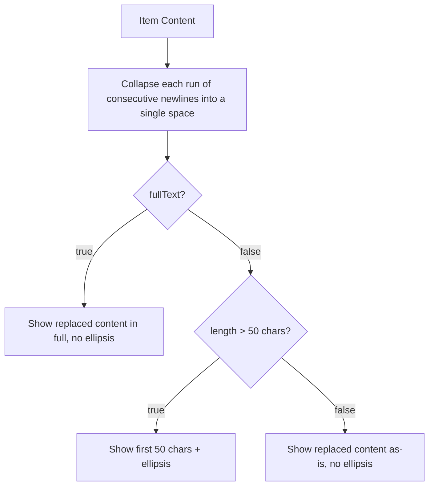

# Design Document

## Overview
**Purpose**: `sava list [date]`（stat無しの日次表示）における複数行contentの1行要約ロジックを、「最初の改行までを1行とする」方式から「改行を除去したうえで、デフォルト表示は50文字まで（超過時は省略記号付き）、`--full-text`指定時は全文」を表示する方式に変更する。
**Users**: `sava list`の出力をMarkdownノートへ貼り付ける、または`grep`/`awk`等にpipeするsavaユーザー（開発者本人を含む）。
**Impact**: `internal/view.Timeline`内の、非stat日次表示におけるcontent要約ロジックのみを置き換える。呼び出し側（`internal/command`, `cmd/sava`）のシグネチャ・呼び出し方は変更しない。

### Goals
- デフォルト表示・`--full-text`表示のどちらでも、常に「1アイテム=1行」を保証する
- デフォルト表示の要約が、改行の出現位置ではなく一定の文字数（50文字）に基づいて決まるようにする
- `sava list --full-text | grep 'word'`で、該当アイテムが`(hash)`を含む行全体として確実に1件・1行でヒットするようにする

### Non-Goals
- 文字数上限（50）をユーザーが変更できるようにすること（固定値のまま。将来必要になれば別specで検討）
- 改行を実際に保持したまま1件を閲覧する手段の追加（`edit <hash>`という既存の代替導線があるため、今回は追加しない）
- `-s`/`--stat`、`-a`/`--all`の出力フォーマット、アイテムの可視性・フィルタロジック自体、チェックリスト接頭辞・hash表記・タグ表記自体の変更

## Boundary Commitments

### This Spec Owns
- `internal/view.Timeline`が、日次表示（非stat）の各アイテムについて、`model.Item.Content`（複数行を含みうる）から画面に表示する1行分の文字列を導出するロジック（改行の除去、文字数切り詰め、省略記号付与）

### Out of Boundary
- どのアイテムを表示するか・どの順で表示するか（`list-task-visibility`で確定済み）
- チェックリスト接頭辞・hashの表記位置・タグの表記位置（`list-output-format`で確定済み）
- `-s`/`--stat`、`-a`/`--all`（stat無し）の出力フォーマット
- 文字数上限の可変化、改行を保持した閲覧手段の追加（このspecでは扱わない。将来必要になれば新規specとして起票する）

### Allowed Dependencies
- `internal/model.Item.Content`（読み取りのみ。`model`側の変更はなし）
- `internal/view`内の既存ヘルパー（`checklistPrefix`, `formatTags`, `formatTime`）— 呼び出し方は変更しない

### Revalidation Triggers
- `list-output-format`が定義した行フォーマット（チェックリスト接頭辞・hash位置・タグ位置）の形が変わる場合、本ロジックの挿入位置（`Timeline`内のcontent算出箇所）を再確認する
- 将来、文字数上限の可変化や改行を保持した閲覧手段を追加するspecが立つ場合、本specが定めた「固定50文字」「改行は常に除去」という前提を明示的に再検証する
- content に `\r\n`（CRLF）が含まれるケースを扱う必要が生じた場合、改行置換ロジック（現状は`\n`のみを対象）を見直す

## Architecture

### Existing Architecture Analysis
- `internal/view.Timeline(w, items, fullText bool)`は、`list-output-format`specで導入された既存関数。現在は非公開ヘルパー`firstLine`で「最初の改行まで」を切り出し、`fullText`が`true`のときはcontentをそのまま使う。
- 呼び出し元は`internal/command.listOneDay`のみで、`opts.FullText`をそのまま`Timeline`の第3引数に渡している（`-s`/`-a`分岐はこの値を参照しない）。
- 今回の変更は`internal/view/view.go`内の非公開ヘルパーの置き換えに閉じ、`Timeline`の公開シグネチャ・呼び出し元は変更しない。

### Architecture Integration
- **Selected pattern**: 既存のView層（`internal/view`）内での純粋関数の置き換え。新しいレイヤー・コンポーネントは追加しない。
- **既存パターンの維持**: `io.Writer`への直接書き込み、`model.Item`への読み取り専用アクセスというviewパッケージの既存方針をそのまま踏襲する。
- **Steering準拠**: `structure.md`が定めた「表示層は`internal/command`から呼ばれる横断レイヤー」という位置づけを変えない。副作用（I/O）を持たない純粋関数のみを追加する。

### Technology Stack

| Layer | Choice / Version | Role in Feature | Notes |
|-------|------------------|-----------------|-------|
| CLI (View層) | Go標準ライブラリ (`strings`, rune変換) | 改行の置換・文字数（rune単位）での切り詰め | 新規依存の追加なし。マルチバイト文字（日本語content）を壊さないよう、バイト数ではなくrune数で切り詰める |

## File Structure Plan

### Modified Files
- `internal/view/view.go` — 非公開ヘルパー`firstLine`を`summarizeContent`（改行置換＋`fullText`に応じた切り詰め）と`truncate`（rune単位の切り詰め＋省略記号付与）に置き換える。`Timeline`のcontent算出行を`content = summarizeContent(item.Content, fullText)`に変更する。
- `internal/view/view_test.go` — `TestFirstLine`を新ヘルパーの単体テストに置き換え、`TestTimeline_MultilineContentShowsFirstLineByDefault`を新しい要約仕様（改行除去＋50文字閾値）を検証する内容に更新する。50文字境界・省略記号・`--full-text`側の改行除去を検証するテストケースを追加する（詳細は Testing Strategy 参照）。
- `internal/command/command_test.go` — `TestListToday_FullTextFlagShowsMultilineContent`内、「50文字以内の複数行content」に対する非full-text期待値を更新する（改行除去により、従来は非表示だった2行目以降の内容が同一行内にスペース区切りで表示されるようになるため）。
- `cmd/sava/root_test.go` — `TestFullTextFlag`と`TestFullListAndFullTextFlagsAreIndependent`が検証している`"first line\nsecond line"` / `"buy cabbage\nand shrimp"`という改行を含む期待値を、改行がスペースに置換された期待値（`"first line second line"` / `"buy cabbage and shrimp"`）に更新する。

### No Changes Required
- `internal/command/command.go`（`ListOptions`, `listOneDay`, `List`）— `view.Timeline(w, items, opts.FullText)`の呼び出しシグネチャは変更なし
- `cmd/sava/commands.go`（`--full-text`フラグ登録）— フラグの追加・変更なし

## System Flows

`Timeline`内でのcontent要約ロジックの分岐（Requirement 1・2共通の1関数で両方をカバーする）:



**Key decisions**: 改行置換は`fullText`の値に関わらず常に最初に行う共通ステップであり、その後の分岐（全文表示 or 50文字切り詰め）だけが`fullText`で変わる。この構造により、Requirement 1とRequirement 2は同一の`summarizeContent`関数1つで実現でき、コードパスの重複がない。

## Requirements Traceability

| Requirement | Summary | Components | Interfaces | Flows |
|-------------|---------|------------|------------|-------|
| 1.1 | デフォルト表示: 改行を半角スペースに置換 | `view.Timeline`, `summarizeContent` | `summarizeContent(content string, fullText bool) string` | Replace |
| 1.2 | 50文字超過時は先頭50文字+省略記号 | `view.Timeline`, `summarizeContent`, `truncate` | `truncate(s string, maxRunes int) string` | CheckLen → Truncate |
| 1.3 | 50文字以内はそのまま表示（省略記号なし） | `view.Timeline`, `summarizeContent` | `summarizeContent` | CheckLen → ShowAsIs |
| 1.4 | デフォルト表示は常に1アイテム=1行 | `view.Timeline` | `Timeline` | — (改行が置換されるため出力に`\n`が残らない) |
| 2.1 | `--full-text`指定時も改行を半角スペースに置換 | `view.Timeline`, `summarizeContent` | `summarizeContent` | Replace |
| 2.2 | `--full-text`指定時は切り詰め・省略記号なしで全文表示 | `view.Timeline`, `summarizeContent` | `summarizeContent` | CheckFull → ShowFull |
| 2.3 | `--full-text`指定時も常に1アイテム=1行 | `view.Timeline` | `Timeline` | — (同上) |
| 3.1-3.4 | `-s`/`-a`の出力・アイテム選別ロジックは不変 | `command.listOneDay`（stat/all分岐, 変更なし） | — | — (本変更が到達しないコードパス) |
| 3.5 | チェックリスト接頭辞・hash表記・タグ位置は不変 | `view.Timeline`（`checklistPrefix`/`formatTags`呼び出し, 変更なし） | — | — |

## Components and Interfaces

| Component | Domain/Layer | Intent | Req Coverage | Key Dependencies (P0/P1) | Contracts |
|-----------|--------------|--------|--------------|--------------------------|-----------|
| `view.Timeline` (modified) | View | 日次表示の各アイテムを1行にレンダリングする | 1.1-1.4, 2.1-2.3, 3.5 | `model.Item` (P0) | Service |

### View

#### Timeline

| Field | Detail |
|-------|--------|
| Intent | 日次表示（非stat）で、各アイテムをチェックリスト構文＋要約されたcontent＋hash＋tagsの1行として描画する |
| Requirements | 1.1, 1.2, 1.3, 1.4, 2.1, 2.2, 2.3, 3.5 |

**Responsibilities & Constraints**
- `fullText`の値に関わらず、content内で連続する改行（例: 空行を挟む`\n\n`）はまとめて半角スペース1つに圧縮してから表示用文字列を確定する（改行1つごとにスペース1つを積み上げるのではなく、連続する改行のランを単一のスペースに正規化する）
- `fullText == false`のときのみ、置換後の文字列を50文字（rune単位）で切り詰め、切り詰めが発生した場合のみ末尾に`…`を付与する
- チェックリスト接頭辞・hash表記・タグ表記の算出ロジック（`checklistPrefix`/`formatTags`/`formatTime`）には一切手を加えない

**Dependencies**
- Inbound: `command.listOneDay` — 日次表示から呼び出される (P0)
- Outbound: `model.Item` — `Content`フィールドを読み取る (P0)

**Contracts**: Service [x] / API [ ] / Event [ ] / Batch [ ] / State [ ]

##### Service Interface
```go
func Timeline(w io.Writer, items []model.Item, fullText bool)

// summarizeContent derives the single-line string to display for an
// item's (possibly multi-line) content: each run of one or more
// consecutive newlines is always collapsed into a single space; when
// fullText is false, the result is truncated to 50 runes with a
// trailing "…" if it exceeds that length.
func summarizeContent(content string, fullText bool) string

// truncate cuts s to at most maxRunes runes, appending "…" if
// truncation occurred. Rune-based (not byte-based) so multi-byte
// characters (e.g. Japanese content) are not corrupted mid-character.
func truncate(s string, maxRunes int) string
```
- Preconditions: `content`は任意のUTF-8文字列（複数行・空文字列を含む）
- Postconditions: `summarizeContent`の戻り値は改行文字を含まず、連続する改行に由来する連続スペースも含まない（常に単一の半角スペースに圧縮済み）。`fullText == false`の場合、戻り値の文字数は50文字以下、または「50文字+`…`」のいずれか。`fullText == true`の場合、戻り値は改行のみを圧縮置換した全文で、切り詰めは行われない
- Invariants: `Timeline`が出力する行数は、常に`len(items)`と一致する（`fullText`の値に関わらず、1アイテム=1行）

**Implementation Notes**
- Integration: `Timeline`内の既存の`if !fullText { content = firstLine(content) }`分岐を`content = summarizeContent(item.Content, fullText)`という無条件呼び出しに置き換える（分岐は`summarizeContent`内部に移る）
- Validation: 50という上限値と省略記号`…`は`view.go`内の定数として定義し、テストから参照可能にする
- Risks: contentが`\r\n`（CRLF）を含む場合、`\r`は置換対象外のため表示上に残る。現状のログ入力経路（`add`/`todo`等）でCRLFが混入するケースは確認されておらず、本specのスコープ外とする（Revalidation Triggers参照）

## Testing Strategy

### Unit Tests (`internal/view`)
- `summarizeContent`: 改行を含み50文字以内のcontentが、改行をスペースに置換した上でそのまま返る（省略記号なし）— 1.1, 1.3
- `summarizeContent`: 改行を含み50文字を超えるcontentが、置換後の先頭50文字+`…`として返る — 1.1, 1.2
- `summarizeContent`: 連続する改行（例: 空行区切りの`"段落A\n\n段落B"`）が、スペースの連続ではなく単一の半角スペースに圧縮される（`"段落A 段落B"`）— 1.1, 2.1
- `summarizeContent`: 置換後がちょうど50文字のとき、省略記号を付与しない（境界値）— 1.2, 1.3
- `summarizeContent`: `fullText == true`のとき、50文字を超えるcontentでも切り詰めず、改行のみ置換した全文を返す — 2.1, 2.2
- `truncate`: マルチバイト文字（日本語content）を含む文字列を50文字で切り詰めても文字化けしない（rune単位の検証）— 1.2

### Integration Tests (`internal/view`, `internal/command`)
- `Timeline`: 複数行かつ50文字を超えるcontentを持つアイテムに対し、`fullText=false`/`true`いずれの場合も出力が1アイテムにつき1行であることを検証 — 1.4, 2.3
- `command.listOneDay`: 2行目以降にキーワードを含む複数行メモについて、`FullText: true`で呼び出した出力に対する1行単位の文字列マッチ（`strings.Contains`によるgrep相当の検証）が、hashを含む行全体にヒットすることを確認 — 2.1, 2.2, 2.3（このspecの動機である`grep`要件のE2E的な裏付け）
- `command_test.go`の既存`-s`/`-a`回帰テストが、`FullText`変更後も出力不変であることを維持していることを再確認 — 3.1, 3.2, 3.3, 3.4

### Existing Tests Requiring Updates (regression, not new coverage)
- `internal/view/view_test.go`: `TestFirstLine`（削除・置き換え）、`TestTimeline_MultilineContentShowsFirstLineByDefault`（期待値更新）
- `internal/command/command_test.go`: `TestListToday_FullTextFlagShowsMultilineContent`（50文字以内の複数行contentに対する非full-text期待値更新）
- `cmd/sava/root_test.go`: `TestFullTextFlag`, `TestFullListAndFullTextFlagsAreIndependent`（改行を含む期待値をスペース区切りに更新）
