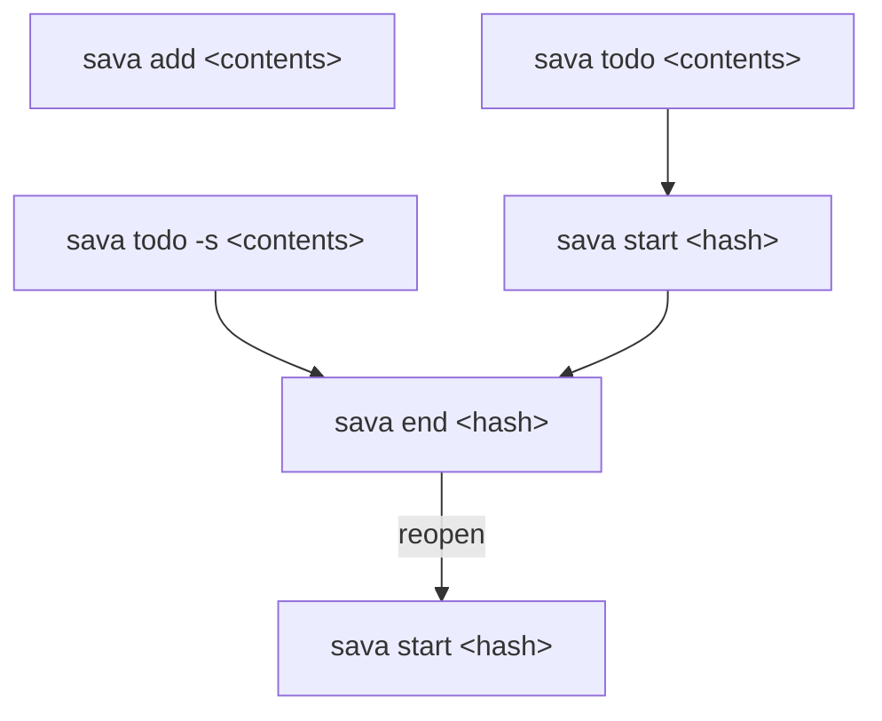

# コマンド体系の再設計: メモログ主軸への転換 (2026-07-12)

## 背景・思想

現行のコマンドは TODO 管理が前提になっている（`add` の既定がタスク、
`list` がタスク優先のセクション表示）。本来の意図は逆で:

* **基本はメモのログ**（時系列のジャーナル）
* TODO は発生したら都度ログに足す（ログの一種）
* **振り返りはデイリー**: 翌日の作業開始時に前日の未完了 TODO を
  今日へ引き継ぐ（スプリントのタスク引き継ぎと同じ思想）。
  引き継いだリストから着手 (`start`) や完了チェック (`end`) をして
  改善していく
* **引き継ぎ（carry）は明示コマンドではなく自然な挙動にする**。
  「今日初めてログに触れた瞬間」に自動で発生し、ユーザーが carry
  という操作を意識する必要はない

データモデルは既にこのモデルを表現できている（`Item` が本体、
タスク性は `closed` の有無というオプション属性）。直すのは CLI の
表面（コマンドの既定値とビュー）のみ。

## 決定事項

1. **`add` はメモ専用にする**（`-m` フラグ廃止）。TODO は専用コマンド
   `sava todo` で追加する
2. **`start` / `end` は独立したトップレベルコマンドのまま、TODO専用の
   操作として残す**（`del` / `tag` と同じ立ち位置: メモ・TODO 両方に
   効く `del`/`tag` に対し、`start`/`end` は TODO にしか効かない）。
   `todo` のサブコマンドにはしない — `todo start <hash>` という形は
   検討したが、`sava todo "start"` のように内容が文字通り "start" /
   "end" である TODO を作成できなくなる（cobra は親コマンドの直下に
   同名の子コマンドがあると、その文字列を子コマンドとして解釈して
   しまうため）。**このため、自由文字列を受け取る `add` と `todo`
   には今後もサブコマンドを一切持たせない**、という制約をガード
   レールとして明記する
3. **過去の日の未完了 TODO は直接操作しない。過去ログは不変。**
   翌日の作業開始時（＝当日のログにまだ何も書いていない状態で、
   最初に書き込みを行うコマンドを叩いた瞬間）に、自動で以下が起きる:
   1. 前日……ではなく、**直近の書き込みがあった過去ログ**を対象にする。
      土日など sava に触れない日を挟んでも、その日のログ自体が
      存在しないため、自動的に「実際に使われていた最後の日」を
      拾える（詳細は下記「自動 carry の仕様」）
   2. その日の未完了 TODO を、今日のログへ**新しい hash を採番した
      コピー**として移す（元の日には手を加えない）
   3. その日のログを **freeze** する（以後一切書き込み不可になる）
   4. 対象の過去ログが**既に freeze 済みだった場合は何もしない**
      （その日はすでに carry 済み、というだけの意味になる）
4. **`list` の既定は時系列タイムライン**（メモと TODO を発生順に混在
   表示）。毎日この自動 carry が働くので今日のログが常に完全な
   バックログになり、全日程横断の未完了ビュー（`list --open` 案）は
   導入しない（チェーンが崩れた場合の保険として将来再検討）

## コマンド体系（目標）

```
sava add <contents>               # メモ追加（既定）
sava add -t <tag>,... <contents>  # タグ付きメモ

sava todo <contents>              # TODO 追加
sava todo -s <contents>           # TODO 追加 + 即着手
sava todo -t <tag>,... <contents> # タグ付き TODO
sava start <hash>                 # 既存 TODO に着手/再開
sava end <hash>...                # 完了（#10: 複数 hash 指定に対応）

sava del <hash>                   # 削除（直近30日を検索。メモ/TODO共通）
sava del <date>:<hash>            # 特定の日を直接指定して削除
sava del --deep <hash>            # 全期間を検索して削除
sava tag ...                      # 既存のまま（当日分のみ）

sava list                         # 今日の時系列タイムライン
sava list <date> / -a / -s / -t   # 既存のまま
sava diff <date>:<hashA>...<date>:<hashB>  # 常に <date>:<hash> を要求
sava clear ...                    # 既存のまま

# sava carry という独立コマンドは存在しない（自動発火のため）
```



タイムライン表示のイメージ:

```
$ sava list
- 09:12 ・ standup メモ
- 09:30 [ ] fix bug (7ba24aef) #cli
- 10:02 ・ shrimp 元気
- 11:15 [x] review PR (1ed29de4)
```

## 自動 carry の仕様

### トリガー: 「今日のログへの最初の書き込み」

carry を独立コマンドにせず、**今日のログファイルがまだ存在しない
状態で最初の書き込みコマンド**（`add` / `todo` / `start` /
`end` / `del` / `tag`）が実行された瞬間に差し込む。

実装上、これは `internal/logfile.Get(dir, "")` が「今日のファイルが
見つからず新規作成する」分岐に入るタイミングそのものと一致する。
つまり carry ロジックは「今日の空ログを作る」処理の拡張として自然に
書ける。読み取り専用の `sava list`（今日）は `logfile.Stat` を使って
おり書き込みを起こさないため、carry のトリガーにはならない
（見るだけでは何も動かない）。

一度今日のファイルが作られれば、以後同じ日にどのコマンドを何回
叩いても「ファイルが見つかった」分岐に入るだけなので、carry ロジックは
再実行されない。**1日1回であることは「ファイルの存在」自体で保証され、
carry 側で二重実行防止のチェックを別途持つ必要がない。**

### 対象日の決定

「直近の過去ログ」は固定で「昨日」ではなく、**実際にログファイルが
存在する日のうち今日より前で最も新しいもの**（`internal/logfile.List`
で列挙できる）とする。土日など未使用の日はそもそもファイルが
作られていないため、特別扱いのロジックなしに自動的に読み飛ばされる。

その日が見つからない場合（初回起動、または見つかった日が既に
freeze 済みの場合）は carry を行わず、今日のログは普通の空ログとして
作られる。

### コピーの中身

* 対象日の `Items` のうち **TODO かつ未完了**（`IsTask() && !IsClosed()`）
  のものだけを対象にする。メモは対象外（メモは動かず、その日の記録に
  留まる）
* 今日への複製は **新しい hash を採番**する
  （`internal/index` の hash → 日付 1対1 前提を守るため）
* `content` と `tags` は引き継ぐ
* `startedAt` と `closed` は引き継がない（複製は「今日はまだ未着手」の
  状態で始まる）。理由は2つ:
  * 「着手」を `start` で改めて記録することで、その日に実際に
    手を付けた時刻が残る（#26: 作業時間の可視化と相性がよい）
  * `createdAt` / `updatedAt` も今日の時刻に更新する。過去の時刻の
    ままだとタイムライン表示（時系列順）で不自然な位置に出てしまう
* 新アイテムに `carriedFrom: <元hash>`（omitempty）を記録する。
  **元アイテムは一切書き換えない**
* `carriedFrom` は #12（reopen）が必要としていた「元タスクへの参照」
  そのもの。reopen は「freeze 済みで完了扱いの TODO を、今日 carry
  し直す」操作として再定義できる見込み（要・実装後の再評価）

### freeze の実装方針（確定: 2026-07-26）

`model.Log.Freezed` フィールドは既にあるが、これを `true` にする
書き込み経路はまだ実装されていない（今回が初めての実用シーン）。

現状の `logfile.Update` のガード（`if body.Freezed { return ErrFreezed }`）
は実際に書き込むデータの内容で判断しており、
実際に「対象 day の既存ファイルのデータ実態」を見ていない。
そのため、データ凍結のために  `logfile.Update` を介することができない。

そのため、  `logfile.Update` での凍結ガードを削除し、凍結による書き込みの禁止は呼び出し側でガードすることとする。

判定専用の新しい関数は作らない。`logfile.Stat` が既に
「あらゆる操作の起点で必ず一度だけ呼ばれる Read 関数」になっているため
（`Get` も内部で `Stat` を呼ぶ）、その戻り値 `LogFile.Body.Freezed` を
呼び出し側がそのまま見ればよい。呼び出し側は次のいずれかの理由で
どのみち `Stat`（または `Get`）を呼んでいる:

* carry の対象日探索: 未完了 TODO を取り出すために、どのみち対象日の
  `Body` 全体を読む必要がある（決定事項 3-4 の「既に凍結済みなら
  スキップ」判定は、この読み込みで得た `Body.Freezed` を見るだけ）
* 書き込み系コマンド（`add` / `todo` / `del` / `tag` など）: 今日の
  ログを読む（`logfile.Get(dir, "")`）のは、そもそも中身を
  変更するために必須のステップ。そのついでに `.Freezed` を見れば済む

一度読んだ `LogFile` をそのまま次の関数（carry なら「凍結して書き戻す」
ステップ）に渡していけば、同じ対象に対して二重にディスクを読みに行く
ことがない。専用の判定関数を挟むと、むしろ「もう読んだのにもう一度
読み直す」窓口を新設することになり、今回の目的（読み込みを一元化する）
と逆行してしまう。

**決定: `internal/log.Add` の `l.Freezed` チェックは撤去する。**
`internal/log` は in-memory な `model.Log` の中身を操作するだけの層で、
どの day を対象にするか・凍結されているかといった横断的な方針判断は
`internal/command`（＋ carry）の責務であり、`internal/log` の各操作
関数が個別に負うべきものではない。他4関数（`Delete` / `Finish` /
`Start` / `AddTags` / `RemoveTags`）はもともとこのチェックを持たず、
`Add` だけが例外だったのが実態に近い（`internal/log` は非対称ではなく
一貫して freeze を意識しない層になる）。

これにより freeze を意識するコードは carry のロジック
（`internal/command`、対象の過去日を読んで `Freezed` を見る／
書き戻す時に立てる）だけに閉じる。

**既存テストへの影響**: `internal/log/log_test.go` の
`TestAddToFreezedLog`（`l.Freezed = true` のログへの `Add` が
`ErrFreezed` になることを期待している）は、このチェック撤去に伴い
削除する。`internal/log.ErrFreezed` は他に使用箇所がなくなるため、
実装時にあわせて削除してよい（`logfile.ErrFreezed` とは別変数で、
今回の決定はそちらの要否には影響しない）。

### ユーザーへの見え方

自動で起きるとはいえ、何が起きたか分からないのは避けたい。
carry が発生した書き込みコマンドの出力に、実行結果の前段として
一言添える案:

```
$ sava todo "write release notes"
Carried 2 items from 2026-07-24 (that day is now frozen).
Added!!
> write release notes (09:03) ab12cd34
```

## 破壊的変更

* `add` の意味が変わる（タスク → メモ）。`-m` は廃止
* `sava start` / `sava end` は独立コマンドのまま存続する（実装は
  #10 の複数 hash 対応を含めて更新される）
* `list` の既定出力フォーマットが変わる（セクション → タイムライン）
* ストレージフォーマットは非破壊（`carriedFrom` は omitempty 追加のみ、
  `freezed` は既存フィールドの初活用で、旧バージョンが書いたファイルは
  引き続き読める）

## 実装フェーズ（案）

* [x] Phase A: `add` メモ化 / `todo` コマンド新設（作成・`-s`・`-t`）/
      `start`・`end`（独立コマンドのまま、複数 hash 対応で #10 を吸収）/
      追加・削除時の結果出力（#25）
* [ ] Phase B: `list` タイムライン化
* [ ] Phase C: 自動 carry（トリガー・対象日探索・新 hash コピー・
      `carriedFrom`・`logfile.Update` の凍結ガード撤去と呼び出し側での
      凍結チェック）→ #8 解決、#12 再評価

## 既存 issue への影響

* #8: 自動 carry（Phase C）に吸収。独立コマンドではなくなったので
      実装後は「carry コマンドが欲しい」ではなく「自動 carry の完成」
      としてクローズ判断
* #9: `end` へのオプション（例: `-a` で当日の未完了 TODO を
      まとめて完了）として Phase A 以降で検討。単独実装は不要
* #10: `end <hash>...` として Phase A で直接解決
* #12: 自動 carry + `carriedFrom` + freeze で大部分が解決する見込み。
       Phase C 完了後に再評価
* #25: Phase A に同梱
* #26: carry された複製は `startedAt` をリセットするため、
       `diff <hash>` 系の作業時間表示は「その日にやった分」を測る指標
       になる（複数日にまたがる累計ではない）。実装時の前提として記録
* #27: タグは carry 後も引き継がれるため、タグ横断検索は影響を受けない。
       有効なまま
* #28: 過去ログは freeze により恒久的に読み取り専用になるため、
       「過去アイテムを直接操作しようとした」エラー案内の重要性が増す。
       有効なまま
* #4: 影響なし。有効なまま

## `<date>:<hash>` 参照形式の導入 (2026-07-26)

### 背景

Phase A のバグ修正ラウンドで、hash 衝突リトライ（`log.Add` の
`uniqueID`）は同じ日のログ内でしか一意性を保証しないことが分かった
（フォローアップレビュー指摘1）。一方 `index.json` の旧 `Hashes`
フィールド（hash → 日付の逆引き）は全期間で hash が一意という前提で
作られており、`sava diff` がそれを使って hash からアイテムを解決
していた。日をまたいだ衝突が起きた場合、`diff` が間違った日の
アイテムを黙って指してしまう可能性があった。

### 決定事項

1. **`sava diff` は常に `<date>:<hash>` 形式を要求する**（bare hash は
   受け付けない）。日付が常に明示されるため、hash の一意性を全期間で
   保証する必要が最初からなくなる
2. これに伴い、`index.json` の `Hashes` フィールド・`command.lookup`・
   `Diff` 内の「index が古ければ1回再構築してリトライ」という
   self-heal の仕組みを**丸ごと削除**した。`Hashes` の唯一の利用者が
   `lookup`（`Diff` からのみ呼ばれる）だったため、`diff` の形式変更で
   このサブシステム自体が不要になった
3. **`sava del` はデフォルトで直近 `storagePeriodDays`（30日）分の
   ログを検索する**（`clear` の保持期間と同じ窓）。今までの「当日分
   のみ」という制約を撤廃し、直近の消し忘れ・書き間違いに対応しやすく
   した
   * 検索して一致が0件なら not found、1件ならそこを削除、2件以上
     （複数日にまたがる hash 衝突）なら**エラーを返して何も削除せず
     終了**し、`<date>:<hash>` で指定し直すよう案内する
   * `<date>:<hash>` を直接渡した場合は検索をスキップしてその日に
     直接アクセスする（曖昧性解消の手段にもなる）
   * `--deep` フラグで直近30日の窓を外し、全期間を検索できる
4. `sava start` / `sava end` / `sava tag` は今まで通り当日分のみ
   （過去ログは不変という原則、およびこれらが TODO のライフサイクル
   管理であり「消し忘れの掃除」とは性質が異なるため、`del` とは
   スコープを分けたままにする）

### 実装メモ

* `internal/log.HashExists`（旧 `hashExists`）をエクスポートし、
  `command.Del` の複数日検索から再利用した（第三の同種スキャン
  ループを増やさないため）
* `command.parseRef`/`resolveRef` を新設し、`Diff`/`Del` 双方が
  `<date>:<hash>` の解析・解決を共有する
* `list` の各行に `<date>:<hash>` をそのまま貼り付けられる形式で
  出す改善は別issue（今回は見送り）
